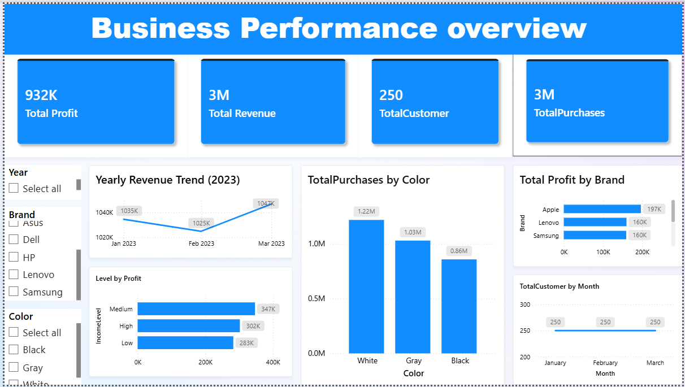

Final Power BI dashboard displaying KPIs and trend analysis

# Business-performance-dashboard-
I cleaned and prepared the dataset, identified key KPIs, visualized important columns, analyzed income levels by profit, and finally built an interactive Power BI dashboard to bring all insights together.

Purpose: “A Power BI dashboard visualizing business performance metrics.”

Tools used: Power BI, DAX, Excel data source.

Key visuals: KPIs, trend charts, slicers.
